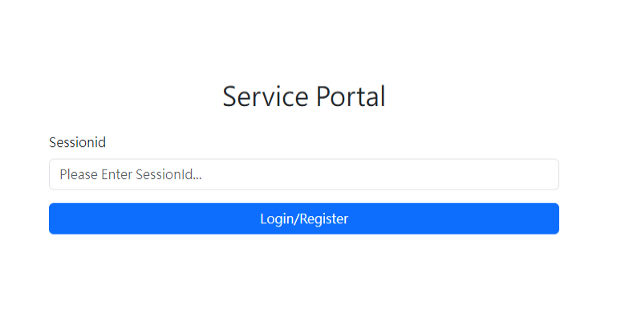
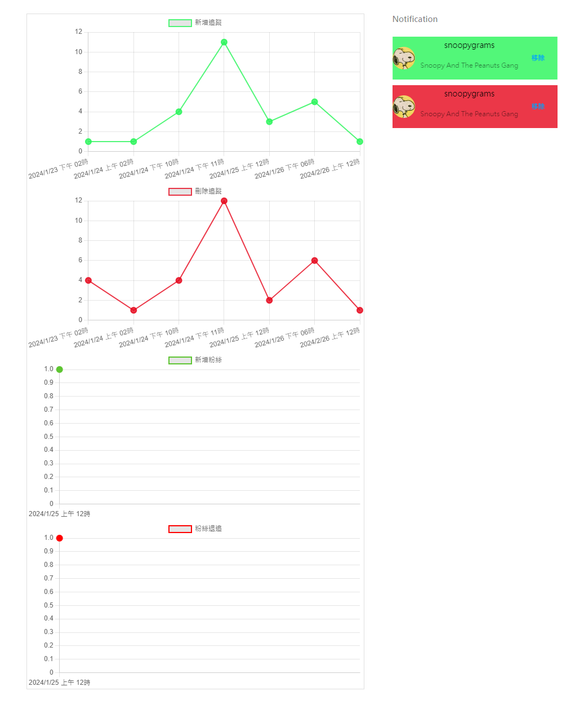

# IG-Monitor-Simulation
Building a web server to record tracking status on Instagram and providing webpage monitoring information 

### **Warning! This program will automately request to Instagram servers, posing a risk of detection for automated actions. It is currently intended for practice purposes only. Please do not run it for long time.**

**Environment**
- IIS
- Asp.net Core 6 Web Api

**Required skills**
- VUE 3
- C#, Dependency Injection
- JWT Bearer Token
- SignalR tools for Web Socket Protocol

**Reference**
- [NadavAzari](https://github.com/NadavAzari/Csharp-instagram-scraper)

# How it works
The orgininal IG API does not support fetching followers and following accounts. Such as Instagram Graph Api just simply offers the basic information of single account. Therefore I had an idea to create my own service to monitor IG following status. 

Here's the approach.

There're some Instagram servers that we can fetch Json strings that contains following, followers information, and personal profile. But all these servers require `Cookie` with `sessionid`.

In this program, I use `sessionid` to request specific URLs to fetch information constantly (default every 30 seconds), then store in textfiles as records. Api will show adds and minus of following/folowers over a period of time.

# Deployment

Simple deployment of a frontend server using IIS.  
Skip IIS setup...

Copy `IG-Monitor-Simulation` -> `FrontEnd` file to IIS

```
C:\inetpub
```

Then change `Default Web Site` -> `Physical Path`  
Port: `80`

```
C:\inetpub\FrontEnd
```

Start Website and go to
```
http://localhost/
```

Then you can see this page



Next, we need frontend server and api match each other.

**Frontend**: `FrontEnd` -> `index.html`
``` javascript
const apiUrl = ref('https://localhost:7119');
```

**Api**: `IgScraperApi` -> `IgScraperApi` -> `appsettings.json`
``` json
"CorsUrls": "http://localhost;"
```
This is for browser CORS setting allowing frontend domain.   
You might use semicolon to concat more URLs.

Finally, build and run Api server
``` bash
cd Api/IgScraperApi/IgScraperApi
dotnet run
```

Request `https://localhost:7119/swagger` for router detail.

# Instructions
1. Login Instagram, then  
Press `F12` to inspect page -> `Application` -> `Storage` -> `Cookies` -> `https://www.instagram.com/` -> Copy `sessionid`

2. Go to `http://localhost` -> paste `sessionid` to the textbox and press `Login/Register`

3. If succeeded, you can see the view



`Notification` will display the information retrieved from the API, which the server immediately broadcasts to the frontend in case of any changes.

# Stored Data Location
IG data is store in .txt files.
```
Api/IgScraperApi/IgScraperApi/IgData/{YourInstagramUsername}
```